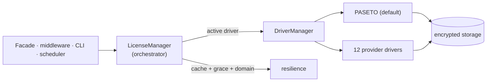

# laranail/license-verifier

[](https://packagist.org/packages/laranail/license-verifier)
[](https://github.com/laranail/license-verifier/actions/workflows/tests.yml)
[](https://github.com/laranail/license-verifier/actions/workflows/static-analysis.yml)
[](LICENSE)

> Headless, provider-agnostic license verification for Laravel — PASETO/Ed25519 offline
> verification, device fingerprinting, seats, grace periods, and pluggable drivers for many
> licensing providers. **CLI/TUI-first**; the web UI ships as separate presets.



The documented API routes through **one** orchestrator, so switching
`license-verifier.default` switches the whole client. See
[docs/architecture.md](docs/architecture.md).

## Targets

- PHP `^8.4 || ^8.5`, Laravel `^13`
- Built on `laranail/package-tools` (+ `laranail/console` for the CLI/TUI)
- Pest `^4` / Testbench — **234 tests**

## Install

```bash
composer require laranail/license-verifier
php artisan vendor:publish --tag=license-verifier-config
```

Set the active driver and credentials in `.env` (prefix `LICENSE_VERIFIER_*`):

```dotenv
LICENSE_VERIFIER_DRIVER=paseto
LICENSE_VERIFIER_SERVER_URL=https://licensing.example.com
LICENSE_VERIFIER_PUBLIC_KEY=...
LICENSE_VERIFIER_KEY=YOUR-LICENSE-KEY
```

## Drivers

One config value (`license-verifier.default`) switches the source. Built-in:

`paseto` (self-hosted `laranail/license-kit`, default) · `envato` (CodeCanyon purchase codes) ·
`keygen` · `lemonsqueezy` · `gumroad` · `cryptolens` · `licensespring` · `freemius` · `edd` ·
`woocommerce` · `paddle` · `unlocksh` · `generic` (config-mapped escape hatch) · `null` (dev).

Register your own without forking:

```php
use Simtabi\Laranail\Licence\Verifier\Drivers\DriverManager;

app(DriverManager::class)->extend('my-service', fn ($app) => new MyDriver(...));
```

Drivers declare **capabilities** (offline tokens, refresh, heartbeat, entitlements, seats,
domain binding); unsupported calls raise `UnsupportedByDriverException`.

## Usage

```php
use Simtabi\Laranail\Licence\Verifier\Facades\LicenseVerifier;

LicenseVerifier::activate('LICENSE-KEY');   // PASETO engine
LicenseVerifier::isValid();                 // offline check
LicenseVerifier::getLicenseInfo();

// Provider-agnostic, via the active driver:
app(\Simtabi\Laranail\Licence\Verifier\Drivers\DriverManager::class)
    ->active()
    ->verify();                             // → VerificationResult
```

Gate routes with the `license` middleware (configurable redirect/abort).

## CLI / TUI

All capability is exposed as commands (`laranail::license-verifier.*`, short `license:*` aliases):

```bash
php artisan license:manage          # interactive TUI dashboard
php artisan license:status --json   # CI gate (exit 0 valid / 1 invalid / 2 unreachable)
php artisan license:activate KEY
php artisan license:drivers         # capability table
php artisan license:doctor          # diagnostics
php artisan license:fingerprint
php artisan license:reminder skip --days=3
```

## Configurable license-detail source + model

`license-verifier.source` chooses where the key/details come from (`config`/`model`/`callback`);
`license-verifier.storage.driver` chooses where the activated record lives (`file`/`database`/
`cache`/`callback`). The `LicenseRecord` Eloquent model is swappable via `license-verifier.models.license`.

## UI presets

- `laranail/license-verifier-ui` — Blade, Filament, Livewire and Vue UI presets in one
  package; install it and pick the preset(s) you need per project.

## Product updates

`laranail/product-updater` consumes this package to gate downloads/updates behind a valid license.

## <a name="documentation"></a>Documentation

Hosted at [`opensource.simtabi.com/license-verifier/docs/`](https://opensource.simtabi.com/license-verifier/docs/).
The same pages live under [`docs/`](docs/):

### Guides

- [Architecture](docs/architecture.md) — ecosystem + internals, sequence/flow/state diagrams (Mermaid).
- [Security](docs/security.md) — encryption pipeline, transport, offline trust model, threat checklist.

### Reference

- [Drivers](docs/drivers.md) — the 14 drivers + capability matrix.
- [CLI](docs/cli.md) — the command map and flows.
- [TUI](docs/tui.md) — the interactive dashboards.

### Project

- [Audit](docs/AUDIT.md) — feature/bug/convention tracking + remediation matrix.
- [Changelog](CHANGELOG.md) — release history.

## Stability

Pre-1.0 (0.x) — the public API may change between minor versions. Pin a version and read `UPGRADE.md`
before bumping.

## Local development

```bash
composer test     # Pest
composer lint     # pint --test + phpstan + rector --dry-run
```

See `docs/AUDIT.md` for the full feature/bug/convention tracking matrix, and `UPGRADE.md` for migration
from the pre-fork releases.

## Sister packages

- [`laranail/license-kit`](https://github.com/laranail/license-kit) — the self-hosted PASETO licensing server (the default driver's backend).
- [`laranail/license-verifier-ui`](https://github.com/laranail/license-verifier-ui) — Blade / Filament / Livewire / Vue UI presets.
- [`laranail/product-updater`](https://github.com/laranail/product-updater) — gates downloads/updates behind a valid license.

## Community

- [Issues](https://github.com/laranail/license-verifier/issues) — bugs + feature requests.

## Contributing & security

- [CONTRIBUTING.md](CONTRIBUTING.md) — workflow + coding standards.
- [SECURITY.md](SECURITY.md) — how to report a vulnerability (see also [Security](docs/security.md)).

## License

MIT © Simtabi LLC. See [LICENSE](LICENSE).
