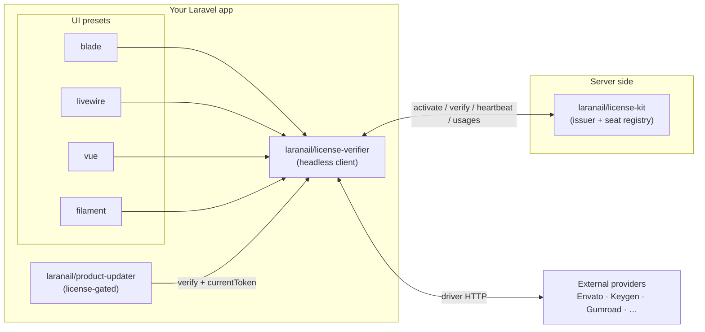
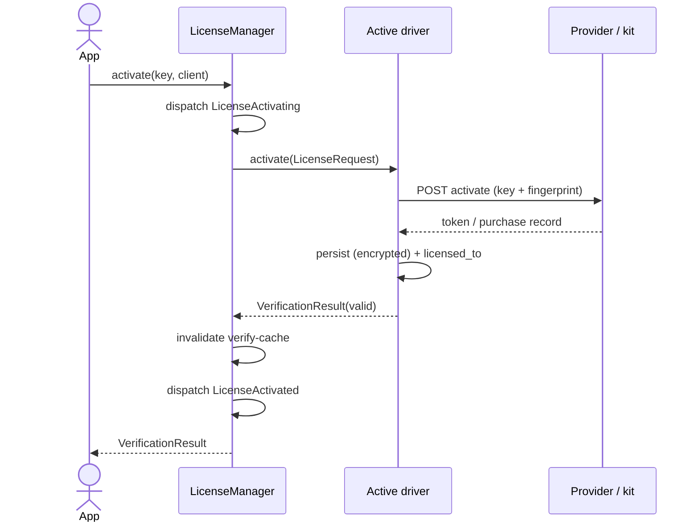
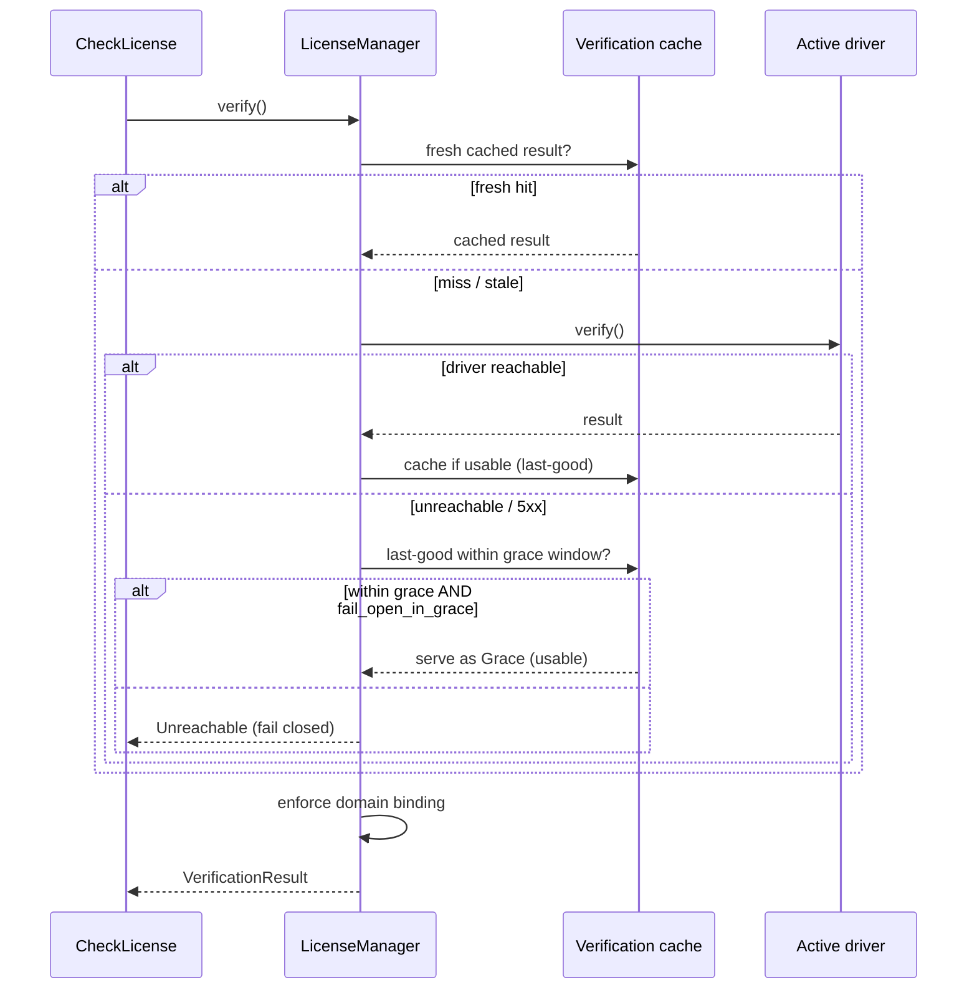
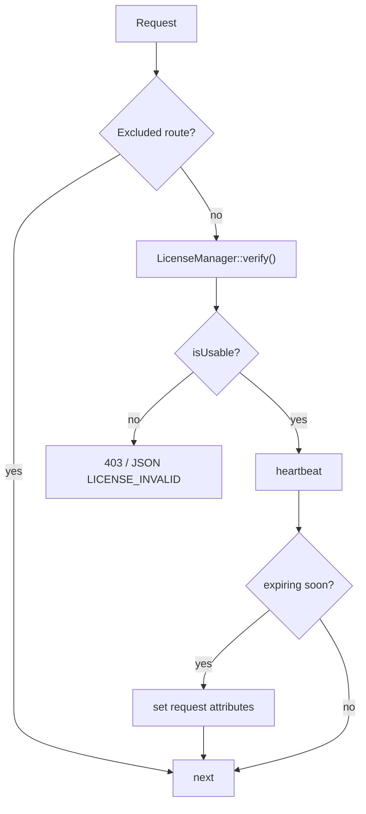
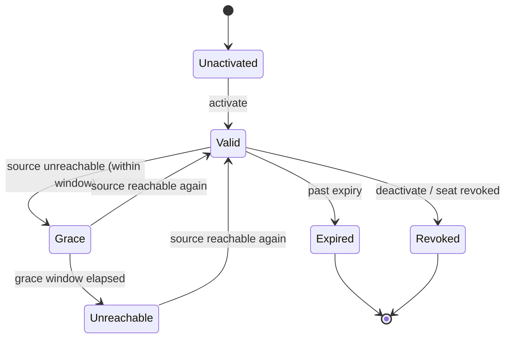

# Architecture

`laranail/license-verifier` is a **headless, provider-agnostic** license client. The
documented API (facade, middleware, Artisan commands, scheduler) flows through a single
orchestrator — `LicenseManager` — which delegates to the configured **driver**. PASETO is
just the default driver; set `license-verifier.default` to any of the 14 drivers and the
whole API follows.

## Ecosystem at a glance



## Internals — the orchestrator and the driver layer

```mermaid
graph TD
    F["Facade: LicenseVerifier"] --> LM
    MW["CheckLicense middleware"] --> LM
    CMD["Artisan commands<br/>activate / verify / seats / …"] --> LM
    SCH["Heartbeat scheduler"] --> LM
    LM["LicenseManager<br/>(Manager + ForwardsCalls)"]
    LM -->|active()| DM["DriverManager"]
    LM -->|cache + grace| CACHE[("verification cache")]
    LM -->|enforce| DB["DomainBinding"]
    LM -->|dispatch| EV["Lifecycle events"]
    DM --> D1["PasetoDriver"] --> ENG["LicenceVerifier engine<br/>(PASETO v4 / Ed25519)"]
    DM --> D2["HTTP drivers ×12<br/>Envato · Keygen · LemonSqueezy · Gumroad<br/>Cryptolens · LicenseSpring · Freemius · EDD<br/>WooCommerce · Paddle · unlock.sh · generic"]
    DM --> D3["NullDriver"]
    ENG --> TS["TokenStorage<br/>(PASETO packing)"]
    TS --> LS
    D2 --> LS[("LicenseStore<br/>file · database · cache<br/>+ resilient fallback")]
```

All persisted state — including the PASETO token, which `TokenStorage` now packs through the
same `LicenseStore` — is encrypted at rest and governed by `storage.driver`, with an encrypted
local file fallback when a remote primary is unreachable. See
[security.md](security.md#resilient-tiered-storage) for the write/read failover flow.

Each driver advertises **capabilities** via small interfaces; the manager capability-gates
the optional verbs (no-op or `UnsupportedByDriverException` when unsupported):

| Capability interface | Verbs | Declared by (e.g.) |
|----------------------|-------|--------------------|
| `SupportsOfflineTokens` | `requiresOnlineRefresh` | paseto |
| `SupportsRefresh` | `refresh` | paseto, keygen, lemonsqueezy |
| `SupportsHeartbeat` | `heartbeat` | paseto, licensespring |
| `SupportsEntitlements` | `entitlements`, `entitledTo` | paseto, cryptolens, freemius |
| `SupportsSeats` | `seatsUsed`, `seatsTotal` | paseto, keygen |
| `SupportsSeatManagement` | `listSeats`, `revokeSeat` | paseto |
| `SupportsDomainBinding` | `boundDomains` | envato, edd, woocommerce |

## Activation (online)



## Verify with cache + grace (offline resilience)



## Middleware gating



## License status lifecycle



See also: [security.md](security.md) (encryption pipeline + threat model),
[drivers.md](drivers.md), [cli.md](cli.md), [tui.md](tui.md).

[← Docs index](../README.md#documentation)
