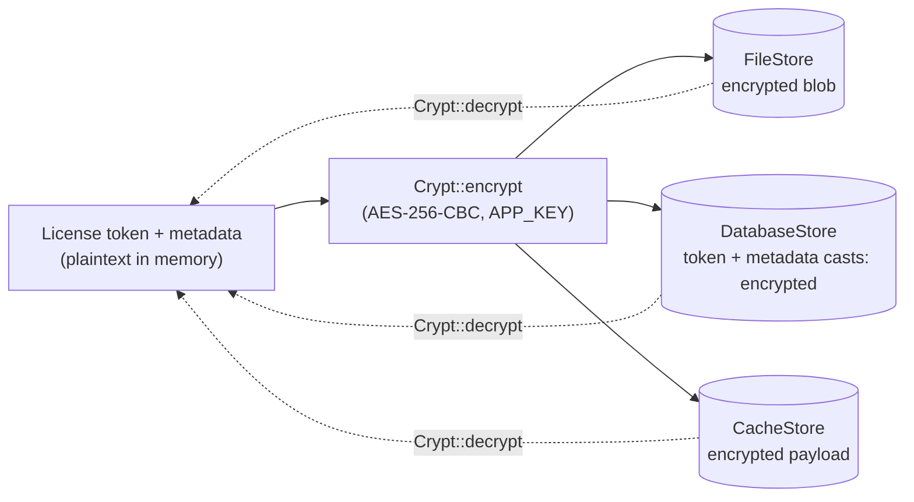
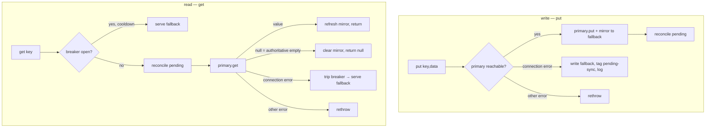
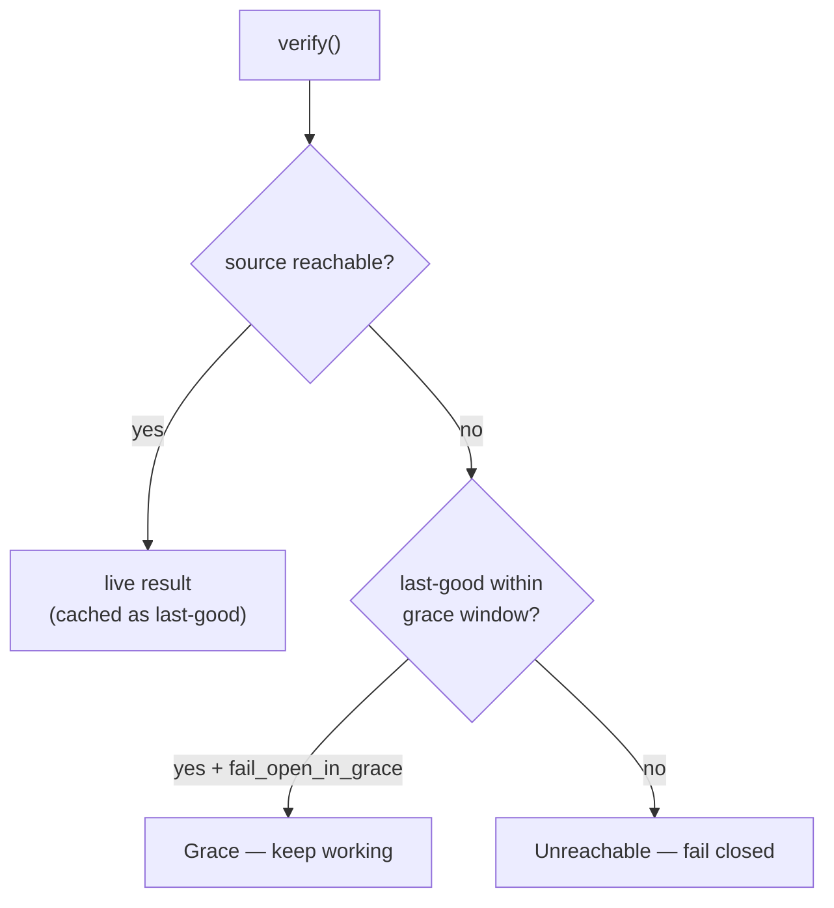

# Security

## Encryption pipeline

Every persistence backend encrypts license data **at rest** using Laravel's `Crypt`
(`APP_KEY`, AES-256-CBC). Whatever the `storage.driver`, the token and sensitive metadata
are ciphertext on disk / in the row / in the cache entry.

| Backend | What is encrypted | Notes |
|---------|-------------------|-------|
| `FileStore` | whole JSON blob | default; under `storage.path/records` |
| `DatabaseStore` | `token` + `metadata` casts | `key`/`status`/`domain` stay queryable |
| `CacheStore` | whole payload | encrypted before `Cache::put` |

The PASETO offline token + protocol metadata are **not** stored separately anymore:
`TokenStorage` routes them through the configured `LicenseStore`, so `storage.driver`
governs where PASETO state lives (and it inherits the same encryption + fallback).

Verify it yourself: `tests/Unit/Stores/EncryptionPipelineTest.php` and
`tests/Feature/PasetoStorageDriverTest.php` assert the raw DB column and cache entry are
ciphertext and that `currentToken()` round-trips for each backend.

## Resilient tiered storage

Pick a **primary** backend with `storage.driver`; when it is a remote backend
(`database`/`cache`) that becomes **unreachable**, the client transparently degrades to an
encrypted local **`storage.fallback`** file (default `file`) via the `FallbackLicenseStore`
decorator. Default `file` primary ⇒ no decorator.

Security invariants:

- **Both tiers encrypt at rest** (AES-256-CBC, authenticated — a tampered fallback fails to
  decrypt and is treated as absent ⇒ fail-closed).
- **Failover only on genuine connection errors** (DB SQLSTATE `08*` / `Connection refused`
  / cache connection exceptions); real SQL/schema errors **propagate** (never silently masked).
- **A reachable primary returning `null` clears the mirror** — a deactivation can't be
  defeated by a stale local file.
- **Circuit breaker** (`storage.fallback_cooldown`, default 15s) avoids paying the connection
  timeout on every request while the primary is down.
- **Pending write-back**: a write made during an outage is reconciled to the primary on
  recovery; `license:doctor` surfaces "serving local fallback" + the pending-sync count.
- The fallback **cannot extend trust** — the PASETO token's own `exp` and the grace window
  still bound offline operation.

## Transport

- TLS verification is **on by default** for all HTTP drivers and the PASETO API client.
  `security.verify_tls=false` opts out (self-hosted servers with internal certificates).
- HTTP drivers and the updater retry transient failures (connection errors + 5xx) with
  linear backoff (`security.retries`, `security.retry_delay`).

## Offline trust model

- Offline PASETO tokens are verified with the **public** key bundle (Ed25519); the signing
  key never leaves the issuer.
- Grace is bounded by `grace_period_days`; after it elapses the app fails closed.
- `fail_open_in_grace=false` makes any unreachable source fail closed immediately.

## Authorization

- Preset license-management endpoints (activate/deactivate/skip-reminder) are gated by a
  configurable Gate ability (`license-verifier-blade.permission`,
  `license-verifier-vue.permission`); unset relies on the route middleware group only.
- Seat listing/revocation on the kit requires the caller's fingerprint to match an **active**
  seat of the same license.

## Threat checklist

| Threat | Mitigation |
|--------|-----------|
| Token theft from disk/db/cache | encrypted at rest on every backend (`APP_KEY`) |
| MITM on activation/verify | TLS on by default; opt-out is explicit |
| Offline tampering of PASETO token | Ed25519 signature; public-key-only client |
| Replaying a revoked seat | server-side seat registry + heartbeat; cache invalidated on deactivate |
| Provider outage taking the app down | cache + bounded grace (fail-open → fail-closed) |
| Unauthorized deactivation via preset UI | Gate ability check on mutating endpoints |
| Wrong-domain license reuse | domain binding downgrades to Invalid |

[← Docs index](../README.md#documentation)
